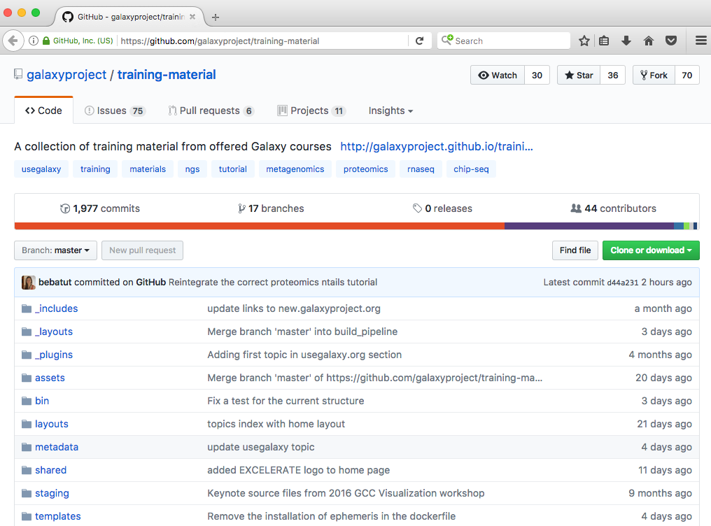

Hello! I am [Bérénice](http://bebatut.fr/), the author of following slides.

<small>
This slide does not exist in original deck. It is useful if you are not familiar with [Reveal.JS](https://github.com/hakimel/reveal.js), used here.
</small>

The easiest way to navigate this slide deck is by hitting `[space]`on your keyboard.

---

### Building an open, collaborative, online infrastructure for bioinformatics training

*image*

Bérénice Batut

<small>
Galaxy Community Conference  June 2017
</small>

---

### Why caring about bioinformatics training?

---

### Galaxy: a great solution!

----

### No need for computational knowledge!

- Web interface for numerous bioinformatics tools
- Scalable
- No issue with computer configuration during training

----

### Used solution

*nb of training events per month*

---

<!-- .slide: data-background="images/gtn_explanation.png" -->

---

 <!-- .element height="40%" width="40%" -->

### Building a new **open**, **collaborative** and **FAIR** model for bioinformatics training

---

### The model

----

### One repository to collect everything

 <!-- .element height="60%" width="60%" -->

GitHub: [galaxyproject/training-material](https://github.com/galaxyproject/training-material)

----

### Requirements

- Easy to use
- Support for effectively learning under multiple scenarios
- Definition of technological infrastructure
- Limited redundancy

----

### Topics for different targeted users

----

### Similar structure, content and format for all topics

----

### Separation between content and formatting

----

### Clear definition of the technical infrastructure

---

### Online training, but fitting also face-to-face workshops

---

### FAIR

- Findable
    - TeSS
    - Metadata
- Accessible
- Interoperable
- Re-usable

---

### Open 

----

### Open Everything

---

### A Community effort

----

### 2 successfull Hackathons

*number of commits/PR/issues over the time*

----

### 44 Contributors

*picture of the contributors*

Thanks to them!!!

---

### Thank You!

