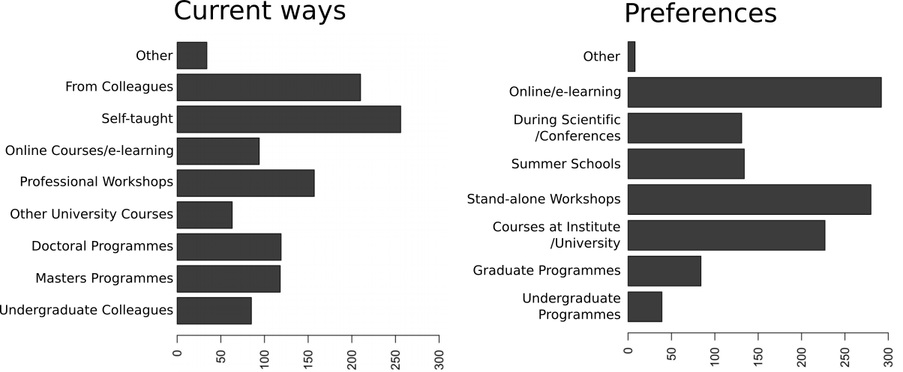
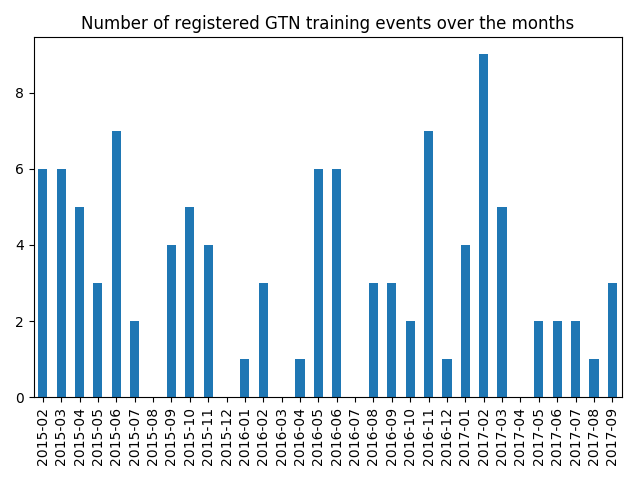
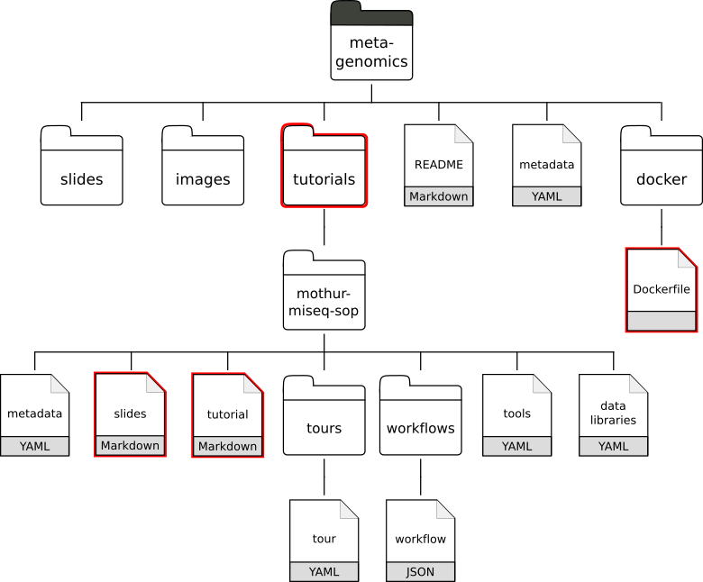
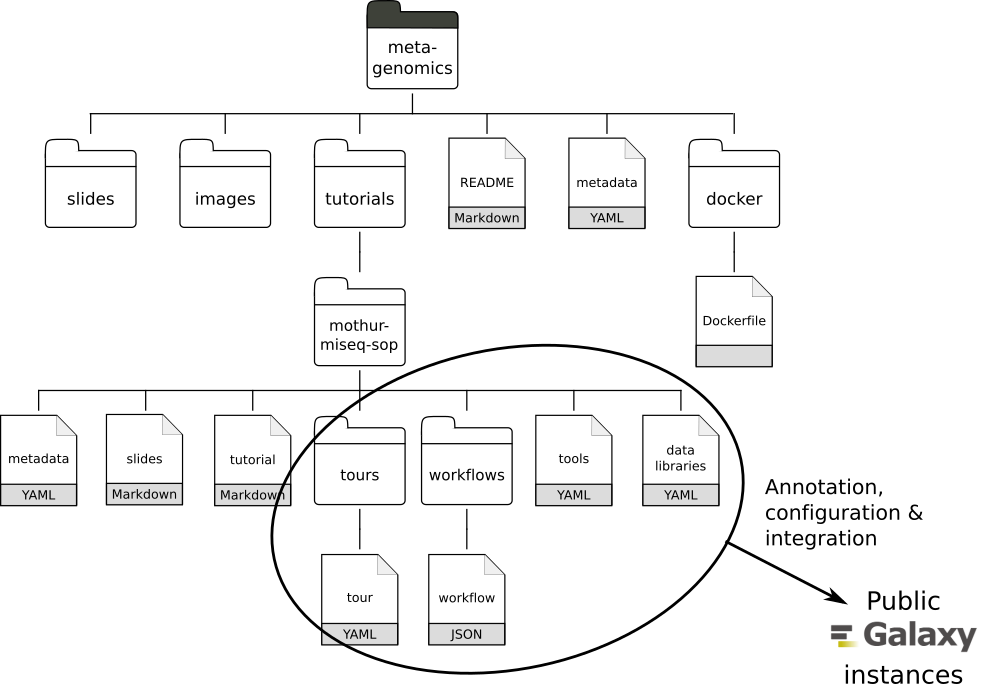
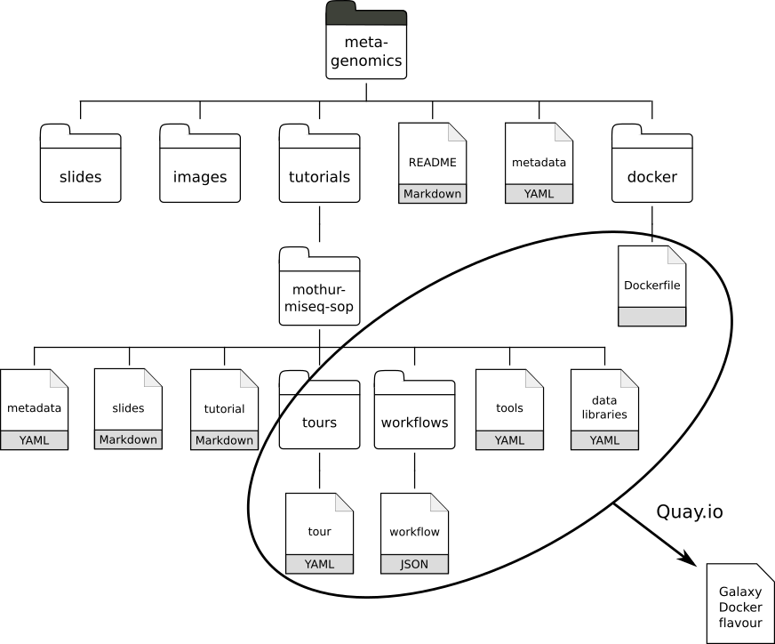
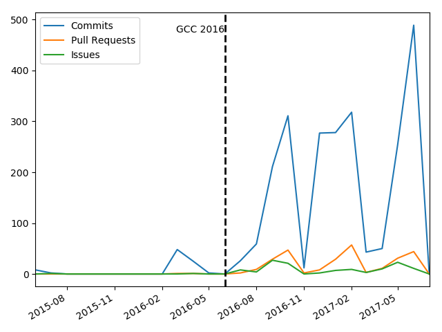
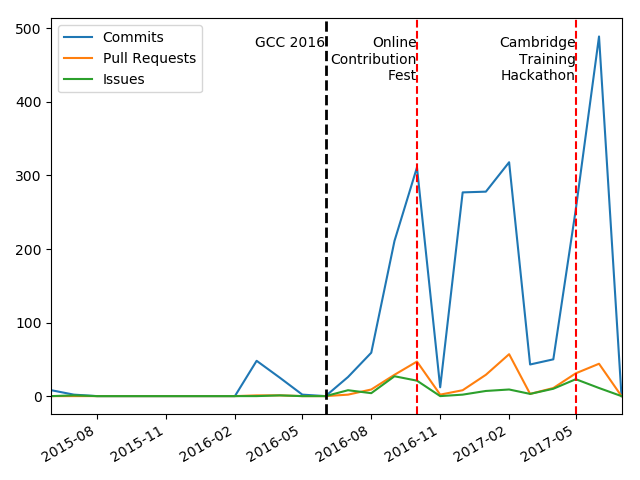
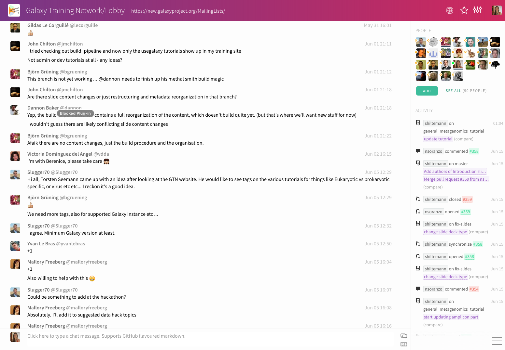
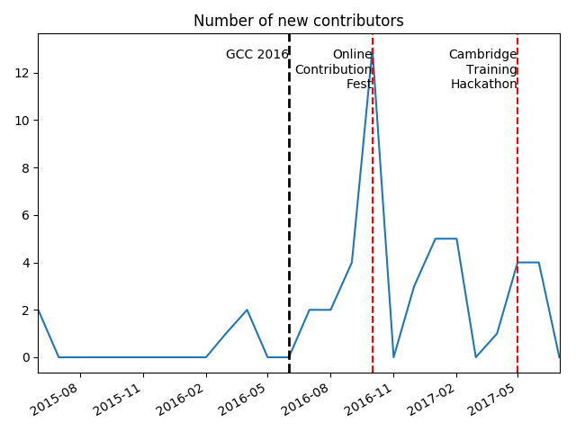

Hello! I am [Bérénice](http://bebatut.fr/), the author of following slides.

<small>
This slide does not exist in original deck. It is useful if you are not familiar with [Reveal.JS](https://github.com/hakimel/reveal.js), used here.
</small>

The easiest way to navigate this slide deck is by hitting `[space]`on your keyboard.

---

### Building an open, collaborative, online infrastructure for bioinformatics training

*image*

Bérénice Batut

<small>
Galaxy Community Conference  June 2017
</small>

---

<!-- .slide: data-background="images/freiburg_workshop.jpg" data-state="dim-background"-->

# Why caring about bioinformatics training?

----

### Need for bioinformatic training

> Bioinformatics has become too central to biology to be left to specialist bioinformaticians 

- Explosion of data to analyze
- Access to computational power

----

### An increasing demand  for learning bioinformatics

Graphs of [Brazas et al, 2017](http://biorxiv.org/content/early/2017/02/27/098996)

---

<!-- .slide: data-background="images/DSC_0630.jpg" data-state="dim-background"-->

# Galaxy a great solution !

----

### No required computational knowledge!

 <!-- .element height="60%" width="60%" -->

- Web interface for numerous bioinformatics tools
- Scalable
- No issue with computer configuration during training

----

### A used solution...

----

### Everywhere!

---

<!-- .slide: data-background="images/gtn_explanation.png" -->

---

 <!-- .element height="40%" width="40%" -->

### Building a new **open**, **collaborative** and **FAIR** model for bioinformatics training

---

# The model

----

### One repository to collect everything

 <!-- .element height="60%" width="60%" -->

GitHub: [galaxyproject/training-material](https://github.com/galaxyproject/training-material)

----

### Requirements

- Easy to use
- Support for effectively learning under multiple scenarios
- Definition of technological infrastructure
- Limited redundancy

----

### Topics for different targeted users

----

### Similar structure, content and formats

 <!-- .element height="70%" width="70%" -->

----

### Separation between content and formatting

----

### Definition of the technical infrastructure

 <!-- .element height="90%" width="90%" -->

----

### Definition of the technical infrastructure

 <!-- .element height="80%" width="80%" -->

----

### Definition of the technical infrastructure

 <!-- .element height="70%" width="70%" -->

---

# A

 <!-- .element height="85%" width="85%" -->

# model

----

### Findable

----

### Online & Accessible

 <!-- .element height="55%" width="55%" -->

[http://galaxyproject.github.io/training-material/](http://galaxyproject.github.io/training-material/)

Note: ...but also fitting face-to-face workshops

----

### Interoperable??

----

### Open & Re-usable

- Content: [CC BY 4.0](https://creativecommons.org/licenses/by/4.0/)
- Development on GitHub
- Communications via Gitter
- Open education movement

---

<!-- .slide: data-background="images/osi.jpg"  data-state="dim-background"-->

# Community effort

----

### Numerous contributions

----

### Numerous contributions

And 2 successful hackathons!

----

### Numerous discussions

 <!-- .element height="70%" width="70%" -->

Gitter: [Galaxy-Training-Network/Lobby](https://gitter.im/Galaxy-Training-Network/Lobby)

----

### Regular new contributors

----

<!-- .slide: data-background-color="#000000" data-background="images/contributors.png" -->

<h2 class="fragment" data-fragment-index="2">THANKS to all of them !

---

### Thank You!

*image*

